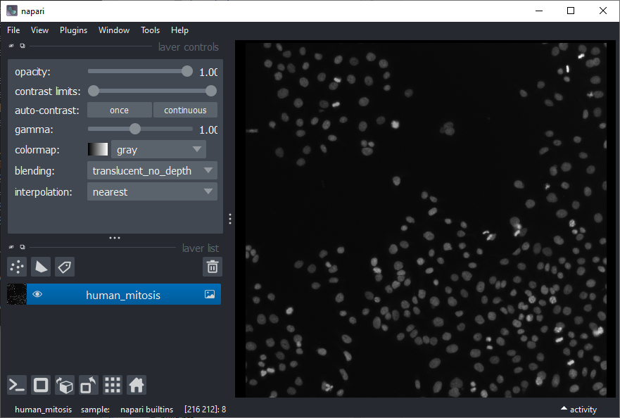
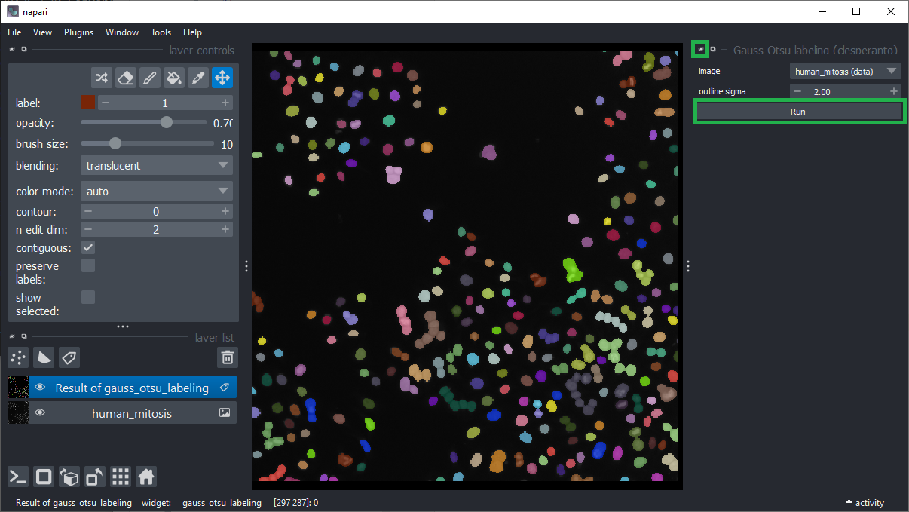
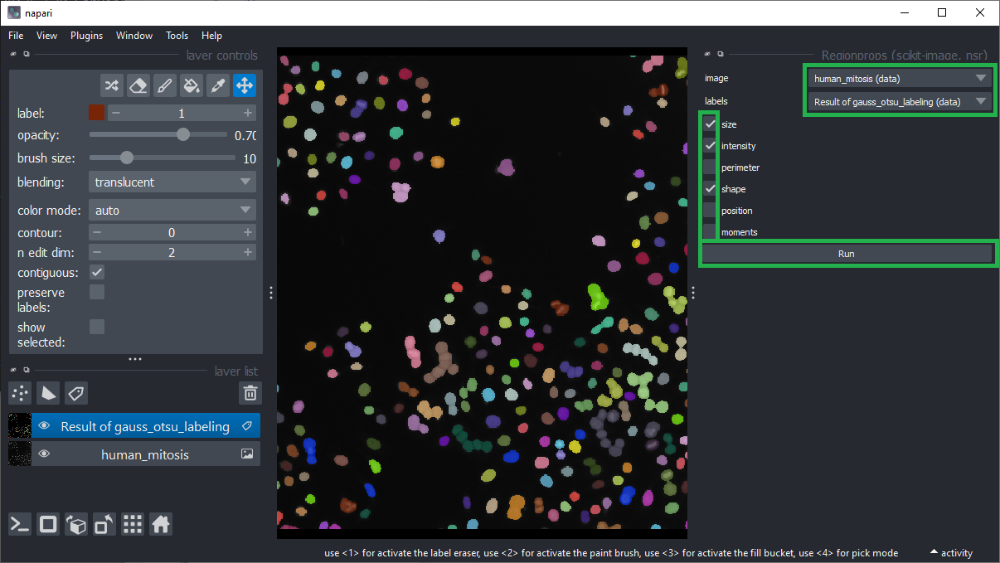
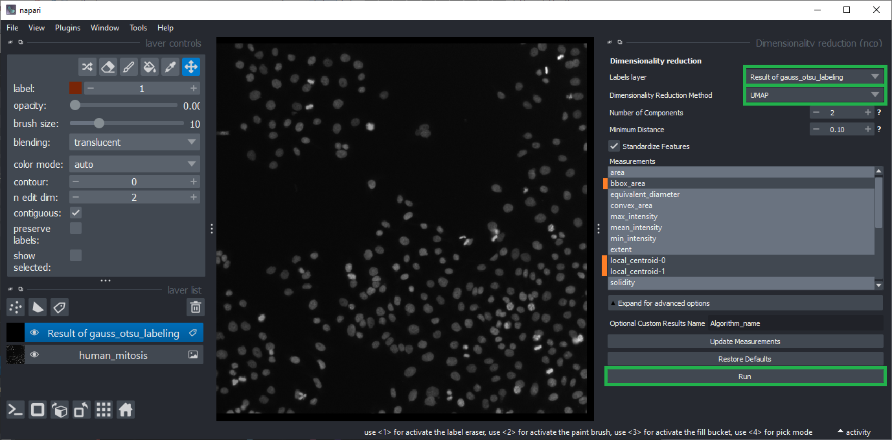
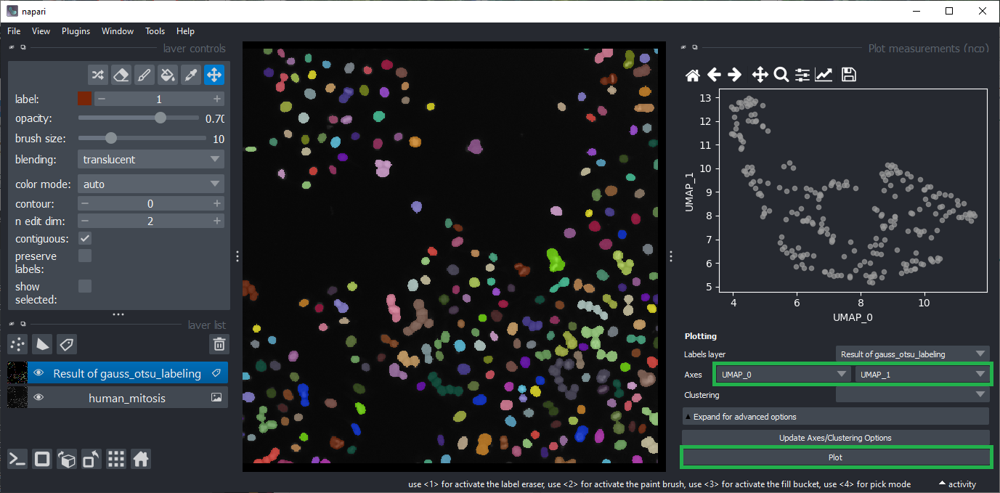
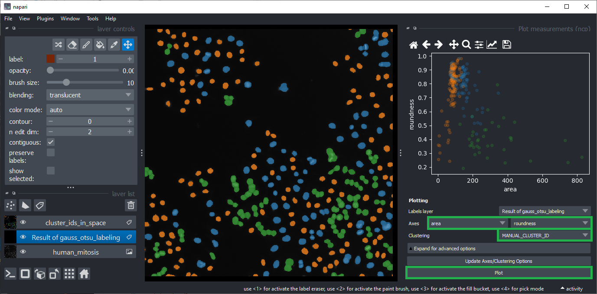
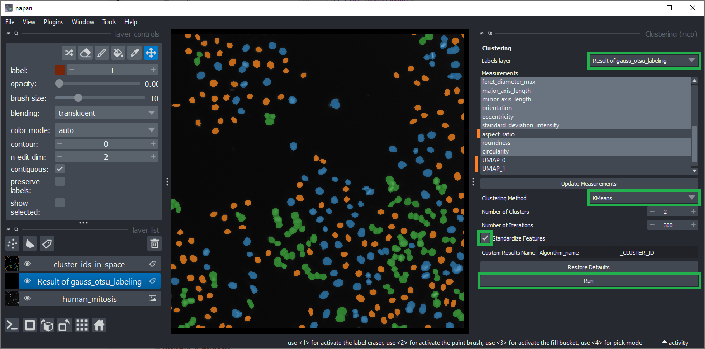
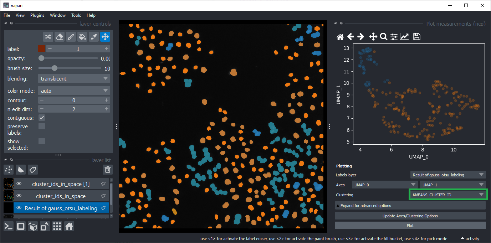
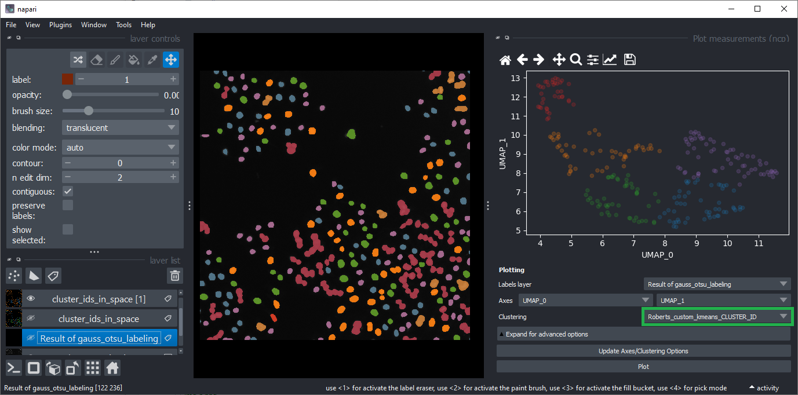

# Interactive object clustering

In this exercise we will use the [napari-clusters-plotter](https://www.napari-hub.org/plugins/napari-clusters-plotter) to group objects together based on their measured properties.
For these measurements we will use [napari-skimage-regionprops]().

## Starting point

Open a terminal window and activate your conda environment:

```
conda activate devbio-napari-env
```

Afterwards, start up Napari:

```
napari
```

In Napari open the "Human mitosis" example dataset from the menu `File > Open Sample > Napari builtins > Human mitosis`.



## Object segmentation

Segment the nuclei using the menu `Tools > Segmentation / Labeling > Gauss-Otsu Labeling (clesperanto)`. 
Keep the default settings and click `Run`.



Use the small hide icon to close the Gauss-Otsu-Labeling widget.

## Feature extraction

Measure shape and intensity features using the menu `Plugins > Measurement Tables > Regionprops (scikit-image, nsr)`.
Make sure that the `intensity`, `size` and `shape` checkboxes are ticked and click `Run`.



Hide both, the Regionprops widget and the Table widget that just popped up.

## Dimensionality reduction

Generate a [UMAP](https://umap-learn.readthedocs.io/) using the menu `Plugins > Measurement post-processing > Dimensionality Reduction > UMAP (nsr)`.
* Make sure the labels layer is selected where you just did your measurements. 
* Choose the method `UMAP` and keep its default settings. 
* Untick the features `bbox_area`, and `local_centroid1` / `2` using the `CTRL` key.
* Click `Run`.
* Wait a minute.



Close both, the Dimensionality Reduction widget and the Table widget that just popped up.

## Plot measurements

Open the plot widget using the menu `Plugins > Visualization > Plot measurements (ncp)`. 
You can play a bit with columns to plot. Eventually select `UMAP_0` and `UMAP_2` as `Axes` and click on `Plot`.




## Manual clustering

Click within the plot and before releasing the mouse button, drag the mouse to select a region of interest.
Repeat this while holding the `CTRL` key to select multiple regions of interest.


The object selection might be related to their shape and size. 
To visualize this hypothesis, you can select the `area` and `roundness` as Axes in the plot widget.
Make also sure the clustering `MANUAL_CLUSTER_ID` is selected.
Click on `Plot` again.



Close the plot widget.

## Automatic clustering

You can also cluster the objects automatically using the menu `Plugins > Measurement post-processing > Clustering (nsr)` menu.
Choose the layer of the segmented and measured objects. 
Unselect the `bbox_area` and `local_centroid1` / `2` features. 
Unselect `aspect_ratio` because it sometimes contains `inf` values which are not supported by the clustering algorithm.
Also unselect `UMAP_0` and `UMAP_1` as these two contain compressed information about all other columns.
Select `K-Means` clustering and activate the `Standardize features` checkbox.
Click on `Run`.



Close the Clustering widget and the Table widget that just popped up.

## Visualizing automatic clustering

To visualize the results of the automated clustering, open the plot widget again using the menu `Plugins > Visualization > Plot measurements (ncp)`.
Select `UMAP_0` and `UMAP_1` as `Axes` and select `KMEANS_CLUSTER_ID` as `Clustering`.



## Exercise

Cluster the objects into 5 classes while having only `UMAP_0` and `UMAP_1` selected in the Clustering widget. 
Give this clustering result a name.
Visualize the resulting clustering using the plot widget.
The result should approximately look like this:




